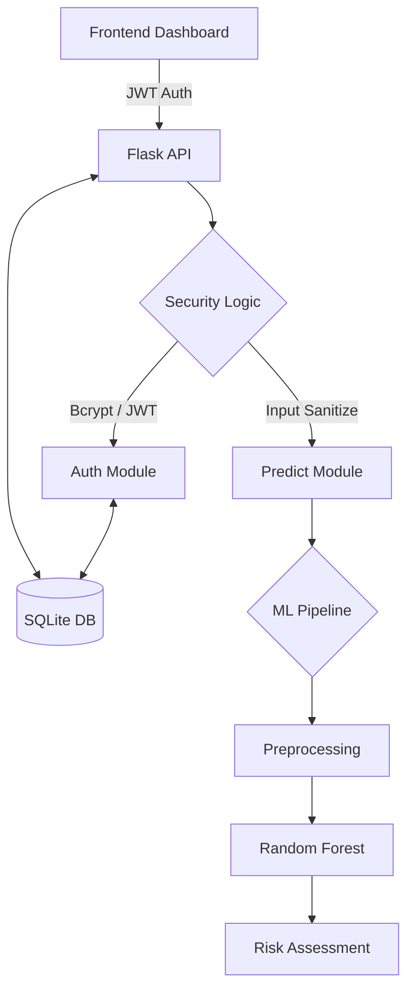

# 🏥 Hospital Readmission Risk — Clinical Decision Support

[](https://www.python.org/)
[](https://flask.palletsprojects.com/)
[](https://scikit-learn.org/)
[](https://reactjs.org/)
[](LICENSE)

An end-to-end Machine Learning system designed to predict 30-day hospital readmission risk for diabetic patients. This project features a robust ML pipeline and a high-performance Flask REST API to assist healthcare providers in discharge planning.

---

## 🏗️ Architecture



### Key Features
- **Production ML Pipeline**: Bundled `sklearn` pipeline with automated preprocessing and decision threshold optimization.
- **Enterprise Security**: JWT-based session management, BCrypt password hashing, and role-based access control (RBAC).
- **Persistent Storage**: SQLite database for secure patient history and user profile management.
- **Dynamic Analytics**: Real-time aggregation of hospital-wide readmission trends and risk distributions.
- **Scalable Design**: Rate-limited endpoints and structured JSON logging for production monitoring.

---

## 📁 Project Structure

```text
hospital-readmission-ml/
├── server/                 # Flask API Backend
│   ├── app.py              #   Production API Entry (Auth, CRUD, Predict)
│   ├── auth.py             #   JWT & Authentication logic
│   ├── database.py         #   SQLite Persistence layer
│   └── predict.py          #   Inference logic & Pipeline loading
├── ml/                     # ML Engineering & Pipeline
│   ├── train_model.py      #   Training script (CV, Hyperopt, Thresholding)
│   └── artifacts/          #   Model artifacts (joblib, json)
├── data/                   # Dataset management (gitignored)
│   └── train.csv           #   UCI Diabetes 130-Hospitals Dataset
├── tests/                  # Automated Testing
│   ├── test_api.py         #   Hardened integration tests (JWT, RBAC)
│   └── test_model.py       #   End-to-end model validation
├── src/                    # React Frontend
│   ├── pages/              #   Dashboard, Analytics, Patient Registry
│   ├── components/         #   Clinical Intake Form, UI Primitives
│   └── services/           #   Auth & API Client (Axios + JWT Interceptors)
├── medpredict.db           # SQLite Database (Auto-generated)
├── .env.example            # Configuration boilerplate
├── README.md               # Project documentation
├── requirements.txt        # Backend dependencies
└── Procfile                # Production deployment config
```

---

## 🚀 Setup & Installation

### 1. Prerequisites
- Python 3.11+
- Node.js 18+ (for frontend)

### 2. Environment Configuration
```bash
git clone https://github.com/PrajwalP2004/hospital-readmission-ml.git
cd hospital-readmission-ml

# Install dependencies
pip install -r requirements.txt
npm install
```

### 3. API Key Configuration
Create a `.env` file from the template:
```bash
cp .env.example .env
# Edit .env and set your configuration
```

---

## 🛠️ Usage Guide

### Model Training
The training pipeline performs stratified 5-fold cross-validation and hyperparameter searching:
```bash
python -m ml.train_model
```
*Outputs: `ml/artifacts/full_pipeline.joblib`, `ml/artifacts/pipeline_meta.json`.*

### Running the Backend
```bash
python -m server.app
# Runs on http://localhost:5000
```

### Running the Frontend
```bash
npm run dev
# Runs on http://localhost:5173
```

---

## 🧪 Testing

The project uses `pytest` for robust endpoint validation:
```bash
# Run all tests
python -m pytest tests/ -v

# Run model inference check
python tests/test_model.py
```

---

## 🚢 Deployment

### Production Hosting (Heroku / GCP / AWS)
The project is configured for cloud deployment via `gunicorn`.

1. **Gunicorn Entry Point**: `server.app:app`
2. **Environment Variables**: Ensure `PORT` is set in your provider's dashboard.
3. **Buildpacks**: Use the Python buildpack.

```bash
# Deployment command (example)
gunicorn server.app:app --bind 0.0.0.0:$PORT --workers 2
```

---

## 📊 Dataset & Metrics
- **Dataset**: [UCI Diabetes 130-US Hospitals (1999-2008)](https://archive.ics.uci.edu/ml/datasets/Diabetes+130-US+hospitals+for+years+1999-2008)
- **Primary Metric**: Recall (Sensitivity) - Crucial for medical readmission detection.
- **Algorithm**: Random Forest Classifier with balanced class weights.

---

## 📜 License
Licensed under the [MIT License](LICENSE).
